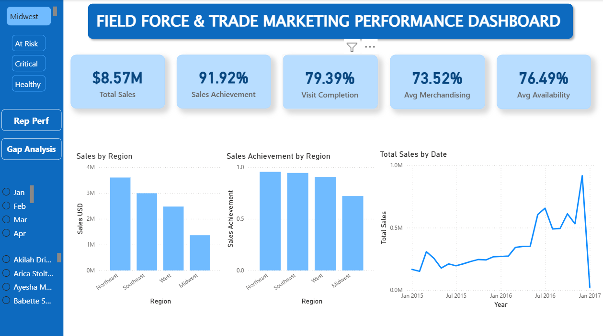
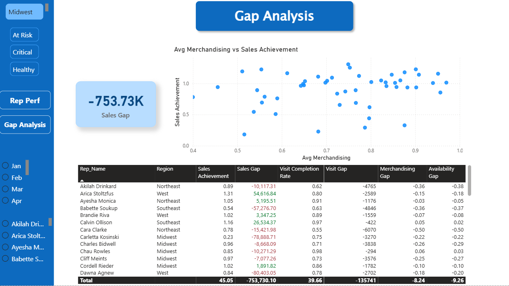
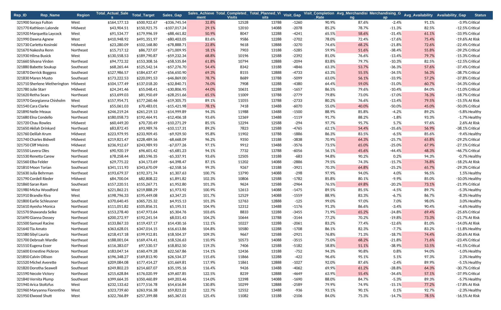
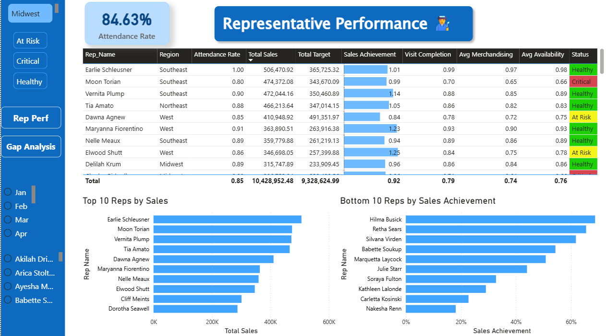

# Field Force & Trade Marketing Performance Dashboard


## Business Problem
Market Express needs visibility into which regions and sales representatives are underperforming, and whether the shortfall is driven by weak selling, poor field execution (visits, merchandising, availability), or both.

## Objective
Combine real commercial data with a field-execution layer to answer:
- Which regions and reps are performing below expectations?
- Is the problem sales, field activity, merchandising execution, or availability?
- Where are the largest performance gaps?
- Which reps/regions need management attention?

## Dataset
**Real data** — `orders.csv`, `accounts.csv`, `sales_reps.csv`, `region.csv`: the "Sales Dataset of Different Regions" (Parch & Posey schema) from Kaggle. 4,050 orders, 351 accounts, 50 sales reps, 4 regions, Dec 2013–Jan 2017.

**Simulated data** — `field_force_operational_data.xlsx`: Working_Days, Attendance_Days, Planned_Visits, Completed_Visits, Merchandising_Compliance, Product_Availability, and Target_Multiplier for 50 reps × 25 months (Jan 2015–Jan 2017). The public dataset does not contain field-force execution metrics, so this layer was built to demonstrate how an analyst would combine commercial performance with field execution data. **This is not real Market Express data.** The original file's simulated values followed the *same* cyclical pattern for every rep (just phase-shifted), so every rep's period average landed near an identical ~76% and no rep could ever be classified "Healthy." This was corrected by regenerating the simulated layer with a genuine per-rep skill factor, so reps now show real, differentiated performance (Merchandising Compliance ranges ~40%–97% across reps rather than clustering at 76% for everyone).

## Data Model
```
Region → Sales Rep → Account → Order
 (region_id)  (sales_rep_id)  (account_id)
```

## Data Cleaning
- Orders' `occurred_at` timestamp split into `Order_Date`, `Year`, `Month`, `Month_Name`.
- Orders joined to Account → Rep → Region via `INDEX/MATCH`.
- Validated: no orders without a matching account, no accounts without a rep, no reps without a region.

## KPI Definitions
- **Sales Achievement** = Actual Sales ÷ Target. **Target** = rep's historical average monthly sales × `Target_Multiplier` (a rising expectation factor, 1.05–1.15 across the period) — chosen instead of "Target = Actual ÷ Multiplier" because that formula is circular and produces near-constant achievement for every rep.
- **Visit Completion** = Completed Visits ÷ Planned Visits.
- **Attendance Rate** = Attendance Days ÷ Working Days.
- **Merchandising Gap** = Actual Compliance − 90% target.
- **Availability Gap** = Actual Availability − 95% target.
- **Status**: Healthy (Achievement ≥ 90% and Merchandising ≥ 80%) / Critical (Achievement < 80% or Merchandising < 70%) / At Risk (otherwise).

## Gap Analysis

<p align="center">
  
  
</p>


`Gap_Analysis` sheet rolls up all 1,250 rep-month records to one row per rep, sorted by `Sales_Gap` ascending (biggest underperformers first), with parallel gaps for visits, merchandising, and availability — so a large sales gap can be diagnosed as an execution problem (weak visits/merchandising/availability too) or a purely commercial one (execution metrics near target).

## Dashboard


Excel `Dashboard` sheet: 5 KPI cards + Sales by Region, Target Achievement by Region, Top 10 Reps by Sales, Bottom 10 Reps by Achievement, Merchandising vs Achievement scatter, and a full Monthly Sales Trend line chart. See `PowerBI_Build_Guide` sheet in the workbook for the equivalent Power BI build (measures, relationships, pages, slicers).

## Key Findings
*(Update with your own read of the final numbers — starter observations below.)*
- Southeast and Northeast reps dominate the top-sales list, but high sales volume alone doesn't guarantee high target achievement.
- A cluster of reps combine sub-80% merchandising compliance and sub-80% availability with weak achievement — see the scatter chart for likely execution-driven gaps.
- Overall visit completion (~90%) is healthy, but average merchandising compliance (~76%) lags materially behind the 90% benchmark across nearly every rep.

## Business Recommendations
- **Reps flagged Critical with low merchandising/availability**: prioritize merchandising audits and supply/availability follow-up rather than adding more visits.
- **Reps with a large sales gap but healthy execution metrics**: investigate commercially (pricing, account mix, territory potential) rather than field execution.
- **Reps with strong visit completion but weak sales**: investigate visit productivity and order conversion, not visit volume.

## Tools
Excel (Power Query-equivalent joins recreated with formulas for portability) + Power BI.

## Data Limitations
The public dataset contains sales, accounts, regions, and sales-representative information only. Field-force operational metrics — attendance, planned/completed visits, merchandising compliance, product availability — were **simulated** for portfolio purposes and must not be interpreted as real Market Express data. All simulated input cells are shown in blue font throughout the workbook; real, formula-derived cells are black.
